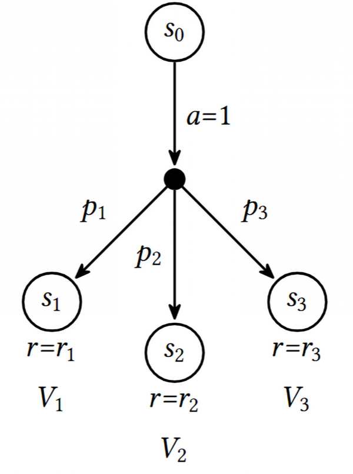
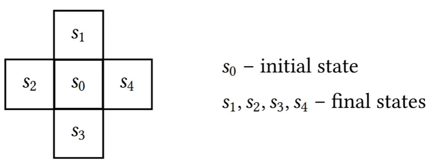
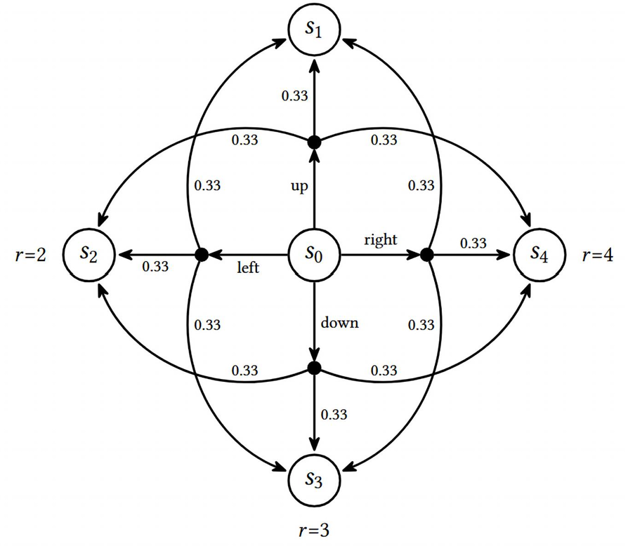

# Tabular Learning and the Bellman Equation

## Value, state and optimality

- Value: the expected total reward (optionally discounted) that is obtainable from the state

Value is always calculated in terms of some policy that our agent follows.

The `reward` is an instantaneous value received by the agent upon taking an action.

`Value` is essentially the sum of the rewards that can be achieved from that state weighted by the probability that those actions will occur until the end of an episode. In other words is the the sum of the proability weighted rewards for all paths that can be taken from the current state.

Ex: Let's say we are in state A and can move to state B or state C with 50% likelihood. The value of state A becomes:

$$
V_A = 0.5(r_{A->B}) + 0.5(r_{A->C})
$$

## Bellman Equation of Optimality

Bellman showed that if we consider not just the immediate reward of getting to the next state but also the long-term value of that new state then we can always choose the best state (optimal)

In the `deterministic` case we only consider the immediate reward + the value of the next state we can choose the optimal state.

In the `stochastic` case we simply introduce probability (p_i) that an action (a_i) will be taken to receive the immediate reward (r_i) and get to a state with value (V_i)

> NOTE: The long-term value of a state can be discounted. Similar to discounting EV of a project by discounting back to NPV. Essentially, this could be thought of similarly to the opportunity to implement 3 different oil and gas projects which have a probability of success an an expected cashflow which could be compared by discounting back to the current state.

**Summary**: At every state the agent ends up in, it needs to select the action with the **_maximum expected reward_**--which is a sum of the immediate reward and the one-step discounted long-term reward.

## Value of the Action

The `value of the action` Q(s,a) -- is the total reward **V(s)** we can get by executing action _a_ in state _s_

Since we always want to maximize this value we can define **V(s)** as the maximum available action value:

$$
V(s) = {max}Q(s,a)
$$

The value of some state equals the value of the maximum action we can execute from this state.

We can recursively (think walking a tree-structure) express Q(s,a) such as:

$$
Q(s,a) = r(s,a) + \gamma \, \text{max} \, Q(s', a')
$$

Note: the value of terminal states (leaf nodes) is equal to their immediate reward (r_i) since they have no further actions that can move them to a new state.

Example: Simple grid-like environment

Transition Diagram:

For the diagram above the `action value Q(s,a)` for the up action is given by:

$$
Q(s_0, \text{up}) = 0.33 \cdot V_1 + 0.33 \cdot V_2 + 0.33 \cdot V_4 = 0.33 \cdot 1 + 0.33 \cdot 2 + 0.33 \cdot 4 = 2.31
$$
